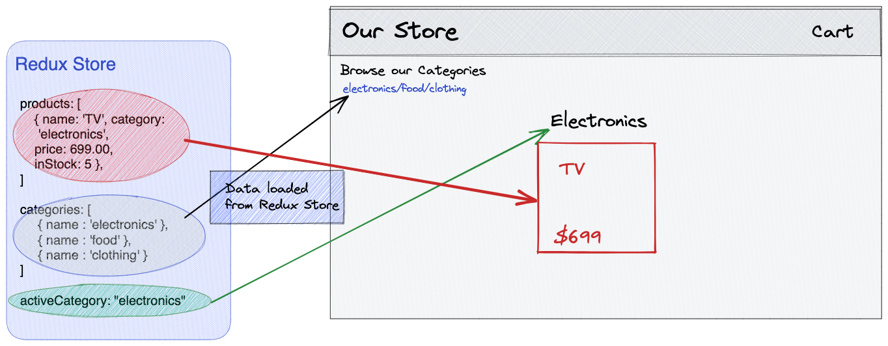

# LAB - CLASS 35 - 38

## Project: Virtual Store -- Application State with Redux

## Author: Kenny W. Lino

## Problem Domain

In this lab, we begin working with Redux in order to store global state information in a Virtual Store app. We are tasked to build this app from scratch using the lab directions and following visual as a guide.

  

With Redux, we store state data about the categories and products in our virtual store. This is done by creating a Redux store (not to be confused with the app virtual store) and defining a number of reducers for categories and products and our active category and dispatch functions to modify the state for these reducers.

After setting up these reducers, we wrap our App with a Provider (like the React Provider API) and pass it our store() function created within the index of our store. This is one of the steps that allows our child components to gain access to the data within our store. From there, we bring in the appropriate data into our components and set up a mapStateToProps and mapDispatchToProps function which is passed to the react-redux connect() function to complete our component access to the data.

We also take a look at the Material UI Component Library to help us set up our front-end. We bring in a number of components over the span of the project, including the AppBar for the Header component and the Breadcrumbs component to display our product categories.

## Links and Resources

* [CLASS-36: CodeSandbox Link](https://1olmp4-3000.preview.csb.app/)

## UML

